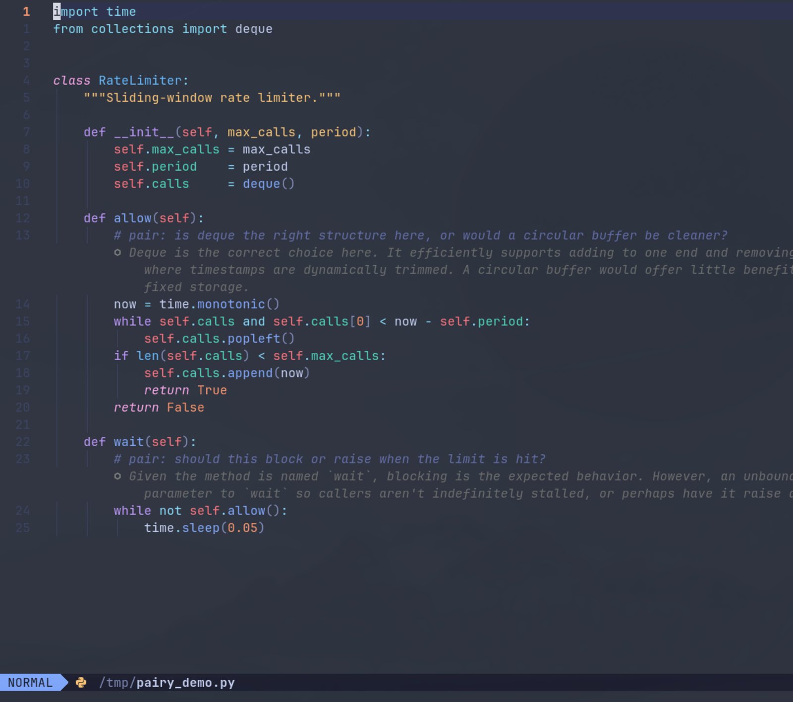

# pairy

[](https://github.com/yash-srivastava19/pairy/actions/workflows/ci.yml)

AI pair programming inside Neovim and Emacs. Write a `pair:` comment, hit a keymap, get a response as inline virtual text — never written to the file.

```ruby
def insert(node, val)
  # pair: should I handle the nil root case here or in the caller?
  ⬡ Handle it here — the function owns its invariants.
  ⬡ Callers shouldn't need to know your internal structure.
```

The AI pushes back, not just answers. It surfaces unstated assumptions and asks one probing question when your reasoning has a gap.



---

## Table of Contents

- [Requirements](#requirements)
- [Installation](#installation)
- [Quick Start](#quick-start)
- [Keymaps](#keymaps)
- [Commands](#commands)
- [Configuration](#configuration)
- [Features](#features)
  - [Conversation Threading](#conversation-threading)
  - [Project Context](#project-context)
  - [Session Saving](#session-saving)
- [Emacs](#emacs)
- [Troubleshooting](#troubleshooting)
- [Development](#development)

---

## Requirements

- Neovim `0.10+`
- `lazy.nvim`
- `curl`
- [Google AI Studio API key](https://aistudio.google.com/app/apikey) — free tier works

---

## Installation

**1.** Clone the repo:
```sh
git clone https://github.com/yash-srivastava19/pairy ~/.local/share/pairy
```

**2.** Add to your lazy.nvim config:
```lua
return {
  {
    dir = vim.fn.expand("~/.local/share/pairy"),
    name = "pairy",
    lazy = false,
    config = function()
      require("pairy").setup({})

      local p   = function(fn) return function() require("pairy")[fn]() end end
      local map = vim.keymap.set
      map("n", "<leader>ais", p("send"),         { desc = "Pairy: Send comment at cursor" })
      map("v", "<leader>ais", p("ask_selection"),{ desc = "Pairy: Ask about selection" })
      map("n", "<leader>air", p("retry"),        { desc = "Pairy: Retry comment at cursor" })
      map("n", "<leader>aic", p("clear"),        { desc = "Pairy: Clear all responses" })
      map("n", "<leader>aix", p("clear_line"),   { desc = "Pairy: Clear response at cursor" })
      map("n", "<leader>aia", p("send_all"),     { desc = "Pairy: Send all pair: comments" })
      map("n", "<leader>aiK", p("cancel"),       { desc = "Pairy: Cancel request" })
      map("n", "<leader>aiw", p("save_session"), { desc = "Pairy: Save session to markdown" })
    end,
  },
}
```

**3.** Restart Neovim, then run `:PairyInit` to create your config file and add your API key.

---

## Quick Start

Write a `pair:` comment in any language and press `<leader>ais`:

```python
# pair: is there a reason to use a class here instead of a module?
```

The response streams in as virtual text directly below the comment. It doesn't touch your file.

In **visual mode**, select any block and press `<leader>ais` — you'll be prompted for a question. Useful for pasting in stack traces, logs, or data and asking about them directly.

Inline comments work too:

```python
result = sorted(items, key=lambda x: x.score)  # pair: is this O(n log n)?
```

---

## Keymaps

| Key | Mode | Action |
|---|---|---|
| `<leader>ais` | normal | Send `pair:` comment at/near cursor |
| `<leader>ais` | visual | Ask a question about the selection |
| `<leader>air` | normal | Retry — re-send comment at cursor |
| `<leader>aia` | normal | Send all `pair:` comments in buffer |
| `<leader>aiw` | normal | Save session to markdown |
| `<leader>aic` | normal | Clear all responses |
| `<leader>aix` | normal | Clear response at cursor |
| `<leader>aiK` | normal | Cancel in-flight request |

---

## Commands

| Command | Action |
|---|---|
| `:PairySend` | Send `pair:` comment at cursor |
| `:PairyRetry` | Re-send comment at cursor |
| `:PairyAll` | Send all `pair:` comments in buffer |
| `:PairySave` | Save session to markdown |
| `:PairyClear` | Clear all responses in buffer |
| `:PairyClearLine` | Clear response at cursor |
| `:PairyCancel` | Cancel in-flight request |
| `:PairyReload` | Reload all pairy Lua modules from disk |
| `:PairyInit` | Create config file from template |
| `:PairyDoctor` | Run `:checkhealth pairy` |

---

## Configuration

Config lives in `~/.config/pairy/config.json`. Run `:PairyInit` to create it from a template.

```json
{
  "api_key":        "YOUR_GEMINI_API_KEY",
  "model":          "gemini-2.5-flash",
  "context_lines":  20,
  "max_tokens":     8192,
  "max_history":    5,
  "sessions_dir":   "~/.local/share/pairy/sessions"
}
```

| Key | Default | Description |
|---|---|---|
| `api_key` | — | **Required.** Google AI Studio API key |
| `model` | `gemini-2.5-flash` | Any Gemini model ID |
| `context_lines` | `20` | Lines above/below the comment sent as context |
| `max_tokens` | `8192` | Max response length in tokens |
| `max_history` | `5` | Prior Q&As included as conversation history |
| `sessions_dir` | `~/.local/share/pairy/sessions` | Where `:PairySave` writes files |

---

## Features

### Conversation Threading

Prior answered `pair:` comments in the buffer are included as history in every new request. The AI already knows what was discussed — you don't repeat context.

### Project Context

Create `PAIRY.md` at your project root. Its contents are prepended to the system prompt on every request:

```
Rails 7.2, Postgres, Sidekiq. Service objects in app/services/. RSpec for tests.
Prefer explicit over clever. No magic methods.
```

pairy walks up from the current file to the git root looking for `PAIRY.md`.

### Session Saving

`:PairySave` collects every answered comment (question + code context + response) and writes it to a timestamped markdown file in `sessions_dir`, then opens it in a floating window. Useful for reviewing what was discussed or sharing with a colleague.

---

## Emacs

`pairy.el` is an Emacs port with the same workflow. It reads the same `~/.config/pairy/config.json` — one config for both editors.

**Requirements:** Emacs `27.1+`, `curl`

**Load from the repo** (equivalent of lazy.nvim's `dir = ...`):

```elisp
;; ~/.emacs.d/init.el
(add-to-list 'load-path "~/.local/share/pairy")
(require 'pairy)
(global-pairy-mode 1)
```

Run `M-x pairy-init` to create the config file if you haven't already.

### Keymaps

| Key | Action |
|---|---|
| `C-c a s` | Send `pair:` comment at point |
| `C-c a c` | Clear all responses |
| `C-c a x` | Clear response at current line |
| `C-c a K` | Cancel in-flight request |

### Commands

| Command | Action |
|---|---|
| `M-x pairy-send` | Send `pair:` comment at point |
| `M-x pairy-clear` | Clear all responses |
| `M-x pairy-clear-line` | Clear response at current line |
| `M-x pairy-cancel` | Cancel in-flight request |
| `M-x pairy-reload` | Reload config from disk |
| `M-x pairy-init` | Create config file from template |

Responses stream in as overlay text below the comment line — never written to the file, same as the Neovim version.

---

## Troubleshooting

Run `:PairyDoctor` or `:checkhealth pairy`. It validates:

- Neovim version (`0.10+`)
- `curl` availability
- API key presence and config file location
- Configured model

If the config file doesn't exist yet, run `:PairyInit` — it creates a template and opens it for editing.

---

## Development

### Run tests
```sh
./scripts/test.sh
```

Runs both suites: 50 Neovim tests (headless nvim + ERT) and 30 Emacs ERT tests (80 total).

### Install local git hooks
```sh
./scripts/setup-hooks.sh
```

Configures `core.hooksPath` to `.githooks`:
- `pre-commit` → runs tests
- `pre-push` → runs tests

CI uses the same command in `.github/workflows/ci.yml`.
